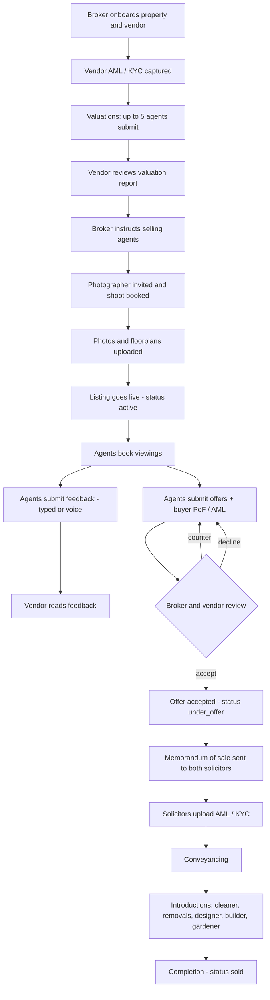
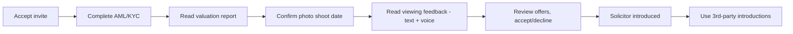
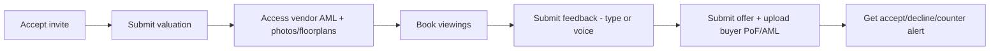
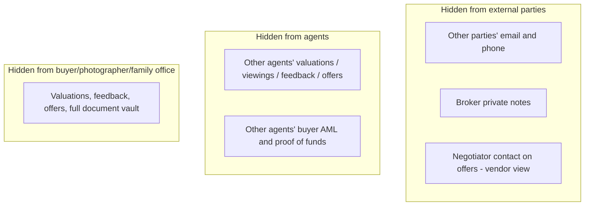

# INHOUS Platform — Journeys, Access & Alerts

How the platform looks and behaves for each participant: what they can do, what
they can see, what is hidden from them, and when they get notified. Diagrams are
Mermaid — they render in Claude / GitHub / VS Code.

---

## 1. Roles

| Role | Who | INHOUS member? |
|------|-----|----------------|
| **broker** | INHOUS — runs the whole transaction | ✅ Yes (full visibility) |
| **vendor** | The seller | ❌ External |
| **agent** | Estate agent / negotiator | ❌ External |
| **vendor_solicitor** | Seller's solicitor | ❌ External |
| **buyer_solicitor** | Buyer's solicitor | ❌ External |
| **buyer** | The purchaser | ❌ External |
| **photographer** | Property photographer | ❌ External |
| **family_office** | Family-office observer | ❌ External |

**Golden rule:** only the **broker (INHOUS)** sees everyone's contact details and
all documents. External parties see what their role needs — and on the
Participants screen they see other people **by name only**.

---

## 2. End-to-end lifecycle

---

## 3. Access matrix (who sees which section)

✅ = full · 👁 = limited/own-only · — = no access

| Section | Broker | Vendor | Agent | V.Solicitor | B.Solicitor | Buyer | Photographer |
|---|:--:|:--:|:--:|:--:|:--:|:--:|:--:|
| Dashboard | ✅ | ✅ | ✅ | ✅ | ✅ | ✅ | ✅ |
| Properties (create/manage) | ✅ | — | — | — | — | — | — |
| Participants | ✅ contacts | 👁 names | 👁 names | 👁 names | 👁 names | 👁 names | 👁 names |
| Valuations | ✅ all | ✅ report | 👁 own | — | — | — | — |
| Viewings | ✅ all | ✅ all | 👁 own | — | — | — | — |
| Feedback | ✅ all | ✅ all | 👁 own | — | — | — | — |
| Offers | ✅ all+detail | ✅ (no contacts) | 👁 own | — | — | — | — |
| Documents | ✅ all | 👁 by type | 👁 by type | 👁 by type | 👁 by type | 👁 by type | 👁 photos |
| AML / KYC | ✅ all | — | 👁 vendor only | ✅ | ✅ | — | — |
| Photography | ✅ | ✅ | — | — | — | — | ✅ |
| Introductions | ✅ curate | ✅ after offer | — | — | — | ✅ after offer | — |
| Notifications | ✅ | ✅ | ✅ | ✅ | ✅ | ✅ | ✅ |
| Admin (users/invites) | ✅ | — | — | — | — | — | — |

### Document visibility by type

| Role | Document types they can see |
|------|------------------------------|
| broker | **everything** |
| vendor | photo, floorplan, EPC, brochure, memo of sale, agent terms |
| agent | photo, floorplan, EPC, agent brochure, memo of sale, agent terms, **vendor AML**, AML verification, **+ their own uploads** |
| vendor_solicitor | vendor AML, AML verification, title register, planning, memo of sale, EPC, proof of funds |
| buyer_solicitor | buyer AML, AML verification, title register, planning, memo of sale, EPC, proof of funds, survey |
| buyer | memo of sale, EPC, brochure |
| family_office | brochure, EPC |
| photographer | photo, floorplan, EPC |

> Everyone can always see **documents they uploaded themselves** (so an agent sees
> their own buyer proof-of-funds even though other agents can't).

---

## 4. Alerts / notifications — who is told, and when

| Event | Broker | Vendor | Agent (the one) | Solicitors |
|-------|:--:|:--:|:--:|:--:|
| Viewing booked (instant) | 🔔 | — | — | — |
| Viewing requested (confirm mode) | 🔔 | 🔔 | — | — |
| Viewing confirmed / declined | — | — | 🔔 | — |
| Feedback submitted | 🔔 | — | — | — |
| Valuation submitted | 🔔 | — | — | — |
| Offer submitted | 🔔 | 🔔 | — | — |
| Offer accepted / declined / countered | — | — | 🔔 | — |
| **Offer accepted** → post-acceptance workflow | 🔔 (action items) | 🔔 | — | 🔔 vendor solicitor |

> AML capture, document uploads/shares, photography booking and introductions are
> recorded in the **audit log** but don't currently raise a notification. (Easy to
> add alerts to any of these if you want them.)

---

## 5. Per-persona journeys

### 👤 Vendor (seller)

- **Can:** see valuations report, all viewings & feedback, all offers, the participant list, photography, post-offer introductions.
- **Cannot:** see agents'/solicitors' contact details, broker's private notes, negotiator contact on offers, buyer AML/proof-of-funds files.
- **Alerts:** new offer received; viewing requested (confirm mode); offer accepted.

### 🏢 Estate agent

- **Can:** submit a valuation (sees only their own), book viewings, log feedback, submit offers, upload buyer documents, see vendor AML + photos/floorplans for brochures, see participants **by name**.
- **Cannot:** see other agents' valuations, viewings, feedback or offers; see anyone's contact details; see other agents' buyer documents.
- **Alerts:** their viewing confirmed/declined; their offer accepted/declined/countered.

### ⚖️ Solicitors (vendor & buyer)

- **Can:** upload & certify AML/KYC, see conveyancing documents (title, planning, memo, proof of funds, etc.), see participants by name.
- **Cannot:** see valuations, viewings, feedback, offers, or the other side's private files.
- **Alerts:** vendor solicitor is notified when an offer is accepted.

### 📷 Photographer

- **Can:** view/coordinate the photography booking, upload photos & floorplans, see participants by name.
- **Cannot:** see valuations, offers, feedback, AML, or any sensitive documents (only photo/floorplan/EPC).
- **Alerts:** none currently.

### 🔑 Buyer

- **Can:** see memo of sale, EPC, brochure; request introductions (designers, builders, removals, cleaners, gardeners); see participants by name.
- **Cannot:** see other offers, feedback, valuations, or contact details.
- **Alerts:** none currently (candidate for "offer accepted — welcome" alert).

### 🤝 Third parties (designers, builders, removals, etc.)
- Not platform logins. They appear in **Introductions** (curated by the broker) and,
  once engaged, in the **Participants → third-party services** list.
- **Broker** sees their contact details + referral fees; everyone else sees company + service only.

### 🏛 INHOUS broker (the hub)
- Sees and manages **everything**: all properties, full contact directory, every
  document, all valuations/viewings/feedback/offers, AML, photography, introductions
  (incl. fees), and Admin (create users / send invites).
- Receives the most alerts (offers, feedback, valuations, viewing activity, and the
  post-acceptance action checklist).

---

## 6. Confidentiality summary (what each role is BLOCKED from)

---

*Status: reflects the platform as built. The only planned feature not yet live is
the **brochure builder** (assemble photos + floorplans into a brochure) — coming next.*
